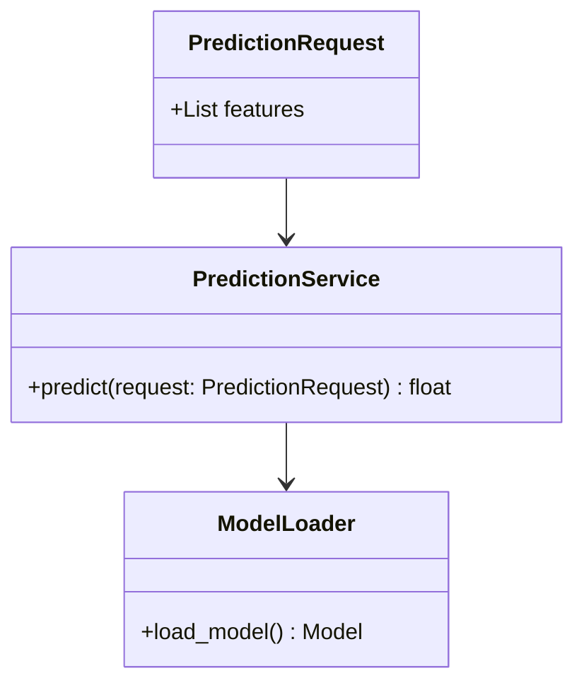
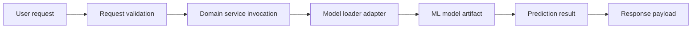
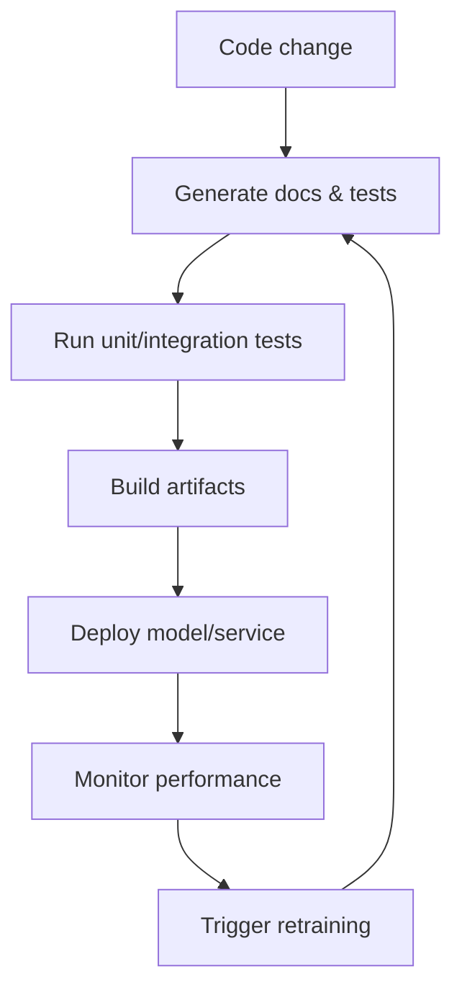

# Architecture Documentation

This document describes the repository architecture using DDD and MLOps principles.
It includes Mermaid diagrams for the domain model and execution flow.

## Domain-Driven Design Structure

- `domain/`: core business entities, value objects, and domain services.
- `application/`: use cases, workflows, and orchestration services.
- `infrastructure/`: persistence, model loading, external integrations, and deployment adapters.

## MLOps Architecture

- Model artifacts and environment definitions are versioned.
- CI/CD pipelines validate tests, build packages, and deploy models.
- Monitoring and retraining guidelines are part of the operational process.

## Domain Model

## Execution Workflow

## MLOps Lifecycle Diagram

## Notes

- Use this page to document architecture changes after each push.
- Keep the Mermaid diagrams aligned with the actual repository structure.
- Update the execution workflow when new data paths or services are added.
